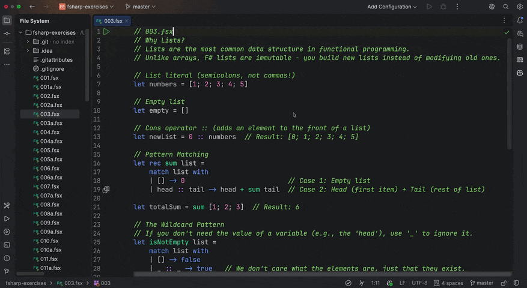

# F# by REPL

Learn F# from scratch by solving exercises in the REPL. All exercises so far were
generated by Claude and reviewed by me. The progression is strict — each exercise
introduces exactly one new concept, and never uses a concept that hasn't been taught
yet. It's a deliberate path from zero, not a random problem set.

When you finish the ones here, point Claude at [`CLAUDE.md`](CLAUDE.md) — the spec
that defines the progression — and it generates the next exercise.



## Setup

**Rider** (recommended — free for non-commercial use):

1. Install [Rider](https://www.jetbrains.com/rider/)
2. Clone this repo, open the folder in Rider
3. In any `.fsx` file, select a code block and press `Ctrl + \` (Windows / Linux)

> On macOS, or if the shortcut doesn't trigger FSI: Settings → Keymap → Main Menu →
> Tools → F# Interactive → *Send to F# Interactive* to see or change the binding.

**Command line:**

```bash
git clone https://github.com/mg0x7BE/fsharp-by-repl
cd fsharp-by-repl
dotnet fsi 001.fsx
```

Requires the [.NET SDK](https://dotnet.microsoft.com/download).

**VS Code:** the [Ionide](https://ionide.io/) extension adds F# support. Check its
docs for the *send to FSI* shortcut.

## How it works

- `NNN.fsx` teaches one concept and gives you a task.
- You write your answer in `NNNa.fsx`.
- When you've done the existing ones, ask Claude for exercise NNN+1 using
  [`CLAUDE.md`](CLAUDE.md) as the spec. It defines the progression, the
  difficulty curve, and what the student knows at each point.

## Exercise example

```fsharp
// 017.fsx
// List.fold applies a function across a list with an accumulator.

let numbers = [1; 2; 3; 4; 5]
let sum = List.fold (fun acc x -> acc + x) 0 numbers  // 15

(*
    Your Task:
    Use List.fold to find the maximum value in [3; 1; 4; 1; 5; 9; 2; 6].
*)
```

## Progress

```
Block 1  Fundamentals      ████████████████████  35 exercises  ✅
Block 2  Practical F#      ████░░░░░░░░░░░░░░░░  in progress
Block 3  Real-world F#     ░░░░░░░░░░░░░░░░░░░░  planned
```

### Block 1: Fundamentals (001–035)

| # | Topic |
|---|-------|
| 001 | Functions, pipe operator |
| 002 | Strings, pattern matching, recursion |
| 003 | Lists, cons operator, recursive processing |
| 004 | Higher-order functions, lambdas |
| 005 | `List.map`, `List.filter`, pipe chaining |
| 006 | `List.sum`, multi-step pipelines |
| 007 | `List.collect`, `List.concat` |
| 008 | Partial application, currying |
| 009 | Function composition (`>>`) |
| 010 | `Option` type |
| 011 | `Option.map`, `Option.defaultValue` |
| 012 | `Option.bind` |
| 013 | Tuples |
| 014 | Records |
| 015 | Discriminated Unions |
| 016 | `Result` type |
| 017 | `List.fold` |
| 018 | `List.reduce` |
| 019 | Combining records, DUs, options, lists |
| 020 | Sequences (lazy evaluation) |
| 021 | `List.choose` |
| 022 | `List.groupBy` |
| 023 | `List.sortBy`, `List.sortByDescending` |
| 024 | Type aliases |
| 025 | Active patterns |
| 026 | `List.collect` (advanced) |
| 027 | `List.partition` |
| 028 | `List.zip`, `List.unzip` |
| 029 | Recursion with accumulator (tail recursion) |
| 030 | Real-world data processing |
| 031–033 | `groupBy` deep dive |
| **034** | **Project: CSV Sales Data Analyzer** |
| **035** | **Project: Task List Manager** |

### Block 2: Practical F# (036–050)

| # | Topic |
|---|-------|
| 036 | `Map` |
| 037 | Map transformations |
| 038 | `Set` |

Next: Arrays, string processing, Result chaining, modules, block project.

### Block 3: Real-world F# (051–065)

Advanced pattern matching, trees, `Async` / `Task`, file I/O, .NET interop,
final project.

## License

[Unlicense](LICENSE).
